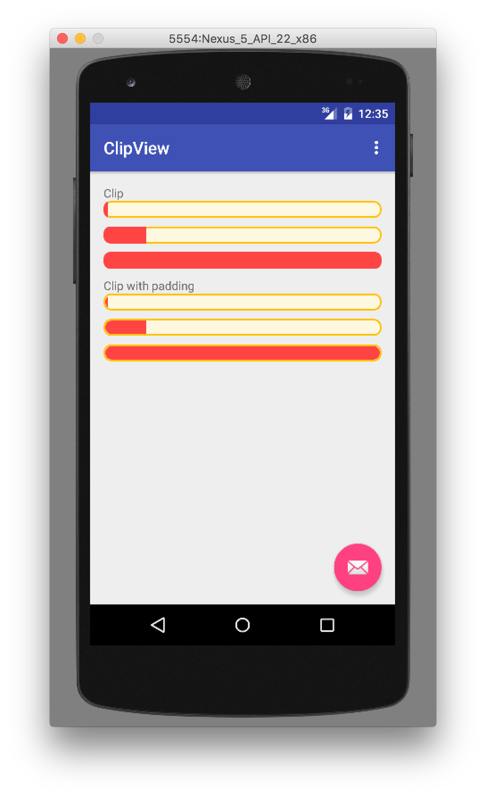

# ClipView [](https://maven-badges.herokuapp.com/maven-central/me.mattak/clipview) [](https://travis-ci.org/mattak/ClipView)

Android library for clipping view.

# Usage

```xml
<me.mattak.clipview.ClipFrameLayout
    android:layout_width="match_parent"
    android:layout_height="20dp"
    android:layout_marginBottom="10dp"
    app:clipPadding="2dp"
    app:clipRound="8dp">

    <View
        android:layout_width="5dp"
        android:layout_height="match_parent"
        android:background="@android:color/holo_red_light" />

</me.mattak.clipview.ClipFrameLayout>
```


